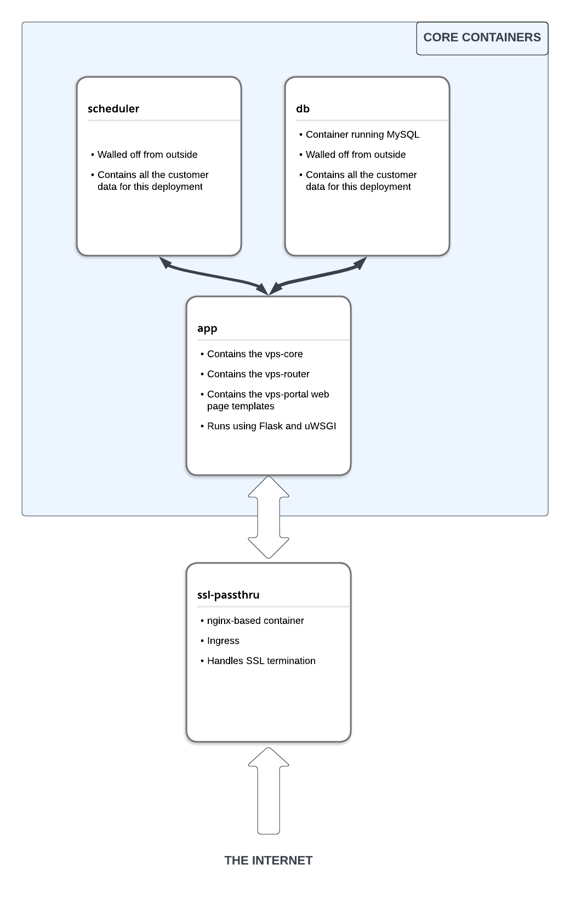

```
                                               _   __   ___    ____
                                              | | / /  / _ \  / __/
                                              | |/ /  / ___/ _\ \  
                                              |___/  /_/    /___/  
                                                                  
                                            Vendor Product Systems 
```



## Vendor Product Systems (VPS) 

This repository contains the development version of the VPS Sales Management System.

This system provides a lightweight and complete product management system that can be extended with custom, dynamically loaded modules.

**The code in this repository is pre-alpha, and will be subject to change. This repository is likely to be deprecated in the near future.**


## Purpose

The purpose of the VPS system is to provide any individual or organization, known as a 
__vendor__, to sell any product or service (known as a __product__), and track the sale (__order__) until delivery. 

## Features

- Cradle-to-grave management of customers, products, and orders
- Easy-to-use management Portal
- Easy-to-use customer communication via SMS and email, integrated with the portal to track customer interactions
- High extensibility via the __module__ system, allowing drop-in extensions of the product tailored to the needs of an individual __vendor__
- __Mitch you should probably write this section__


## Components

This project is composed of three components:

### 1. vps-lib

This consists of a series of interfaces to manage and manipulate customers, orders, products, and empoyees. See the __Core Objects__ section below.

### 2. vps-portal

An internal management interface that allows the customer to add, remove, or otherwise manipulate products, orders, customers, and employees.

### 3. vps-subloader

A dynamic module loading interface allowing the user to extend the functionality of the `vps-core`.

Each module provides a function that allows the user to extend the `vps-core` in whatever way he/she sees fit. The purpose of the `vps-subloader` is to permit a high level of customization in the management of data, 
as well as basic interfaces for using that data in a variety of ways (eg, to send SMS messages, provide metrics, process payments, etc.)

## Core Objects

This application defines "core objects" as objects that modify the four canonical customer-facing databases in some way or another. 

Specifically, these objects consist of:
* `customers`
* `orders`
* `products`
* `employees`

The model for this application is intended to allow each of these databases to be modified by _the same methods_. The intention is to provide a universal interface for discrete sets of data.

To __add__ a customer (`templates/add.html`) should use the same dynamic method as adding an order or product. 

To __modify__ a customer (or order, product, employee) should follow this same extensible framework.

This allows a compact, modularized system that can be extended via the addition of __modules__ to provide 
new functionality to the core product.

## Modules

What makes this system special is the highly extensible usage of **modules**, components that provide additional functionality to the `vps-core` and `vps-portal`. Modules are intended to be added or removed at will 
depending on customer requirements.

Each module is loaded into the running `vps-core` via the `subloader`.

By default, the following modules are loaded:
- `send_sms` - a module to send SMS messages
- `send_email` - a module to send emails
- `remind` - a module to schedule tasks, such as recurring orders or email/SMS reminders
- `reporting` - a module to provide basic business intelligence based on user-provided data


## Configuration

### 1. Bootstrapping the Host

Bootstrapping the VPS host involves provisioning a virtual private server with the cloud houst of your choice. For testing and configuration purposes, this project has used [vultr]("http://vultr.com"). 

1. Set up a base Ubuntu 22.04 (or latest LTS) VM
2. Copy your ssh key to root's `authorized_keys`
3. Execute `python3 bin/install.py`

### 2. Loading the DB Schema

1. SSH to the VPS VM
2. `cd /vps/db`
3. `./load-schema.sh`

### 3. (Optional) Adding test customer data

1. SSH to the VPS VM
2. `cd /vps`
3. `. venv/bin/activate`
4. `python3 db/generate_test_customers.py` to load 25 randomly
generated test customers into the DB.

### 4. Start the VPS system

1. `vpsctl start`

