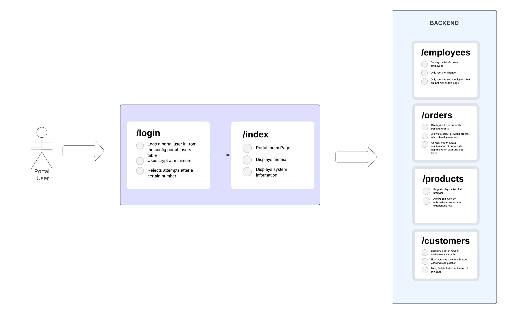

## Portal Page Templates

This directory contains Jinja2 templates for the VPS system portal.

### Overview of Portal Architecture

## 

### Adding, Modifying: `add.html`

The template `add.html` and the commesurate router script, `router.py`, is intended 
to serve as a one-size-fits-all method of modifying core objects.

The template contains three values that determine:
1. The method of interaction (add, modify)
2. The context (customers, orders, products, employees) that selects the database that will be used for this action
3. (If modifying) The selector (customer_id, etc) by which the previous data is modified.

### Displaying Context Information (`/customer`, `/order`, `/employee`, `/product`)

The HTTP endpoints for each database are defined by the database name.

For example, to display the contents of the database "customers", the endpoint will be `/customers`

The pages served by these endpoints will consist of a table, containing the information stored in the relevant database,
(defined in `lib/models.py`). Each entry for this table will correspond to a row in the database for the context. 

Each entry will have an "Actions" button. This actions button will provide a drop-down menu with 
methods to:
- alter or delete the entry
- 

### 